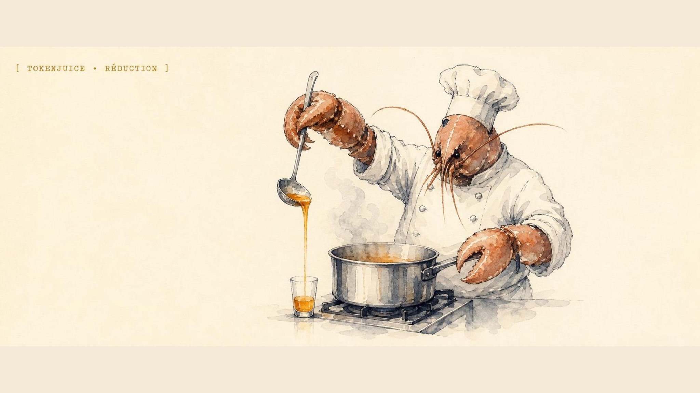
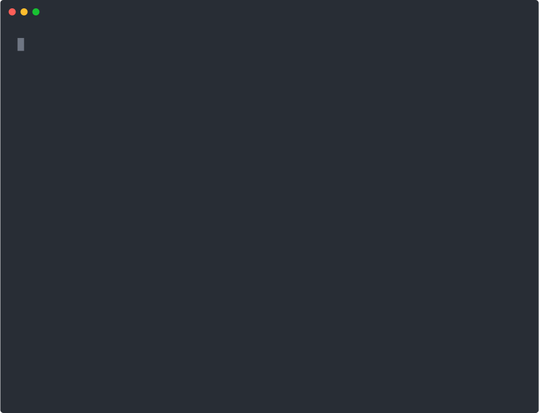

<p align="center">
  
</p>

<h1 align="center">tokenjuice 🧃</h1>

<p align="center">
  <strong>Deterministic output compaction for terminal-heavy agent workflows: run the command, trim the wall of terminal text, hand the harness a smaller payload, keep the raw bytes one flag away.</strong>
</p>

<p align="center">
  
  
  
</p>

<p align="center">
  A fork maintained by <a href="https://github.com/escoffier-labs">Escoffier Labs</a> &middot; original by <a href="https://github.com/vincentkoc/tokenjuice">Vincent Koc</a>
</p>

tokenjuice is a deterministic output compactor for terminal-heavy agent workflows: it runs noisy commands like `git status`, `pnpm test`, `docker build`, or `rg`, keeps the command semantics untouched, and returns a smaller payload built from rule-driven JSON reducers instead of dumping the whole wall of terminal text back into context. The reason is leverage: agent context is finite and expensive, so less transcript waste means fewer useless reruns and cleaner handoff between tools without making the shell magical. This repository is a fork of the upstream project that re-points its own project metadata (homepage, repository, issue tracker) at `escoffier-labs/tokenjuice` and tracks the build the Escoffier Labs agent fleet runs; the reducer engine, host integrations, and CLI surface are upstream's, used and extended under the MIT license.

> tokenjuice is a fork of [vincentkoc/tokenjuice](https://github.com/vincentkoc/tokenjuice) by Vincent Koc, used and extended under the MIT license; we are also a contributor to the upstream project. The original project, its npm package, and its Homebrew tap remain Vincent's; this fork does not publish a separate package and credits the upstream author throughout. See [What this fork changes](#what-this-fork-changes).

<p align="center">
  
</p>

Wrap any noisy command and tokenjuice returns a compacted, deterministic payload with a neutral footer noting what was omitted. The raw bytes stay one `--raw` flag away.

## What it does

tokenjuice sits between an agent or harness and the noisy tools it calls. The command still runs untouched; tokenjuice observes the output after execution and returns a compacted, deterministic summary built from inspectable JSON reducers, so the language model gets a clean payload instead of token-burning terminal junk. It trims the fat from `git status`, `pnpm test`, `docker build`, `rg`, `pnpm --help`, and similar high-noise commands, while exact file-content reads stay raw and unsafe mixed command sequences are left alone. Raw output stays available only when you explicitly ask for it through `--raw` / `--full` or opt-in artifact storage, rules stay inspectable JSON instead of model vibes, and host integrations stay thin wrappers around the same core reducer instead of becoming one-off adapter logic.

## Integrations

tokenjuice installs a thin hook, extension, rule, or guidance file into your client; all of them call the same shared reducer. First-class clients include [Claude Code](https://docs.anthropic.com/en/docs/claude-code), [Codex CLI](https://github.com/openai/codex), [Cursor](https://cursor.com/docs/hooks), [GitHub Copilot CLI](https://github.com/github/copilot-cli), [OpenClaw](https://openclaw.ai/), [OpenCode](https://opencode.ai/), and [pi](https://github.com/badlogic/pi-mono/tree/main/packages/coding-agent), with 100+ more clients in beta.

See **[docs/integrations.md](docs/integrations.md)** for the full client list, each install command, and the hook file it writes.

## install

This fork is not published as a separate package. The `tokenjuice` name on npm and the `vincentkoc/tap` Homebrew tap both install the **upstream** build by Vincent Koc, not this fork's tree. To install upstream:

```bash
npm install -g tokenjuice
# or
pnpm add -g tokenjuice
# or
yarn global add tokenjuice
# or
brew tap vincentkoc/tap
brew install tokenjuice
```

To run **this fork's** tree instead, install from source:

```bash
git clone https://github.com/escoffier-labs/tokenjuice.git
cd tokenjuice
pnpm install
pnpm build
node dist/cli/main.js --version
# optionally expose it on PATH:
pnpm link --global   # then `tokenjuice --version`
```

then run it, and install into any client (see [docs/integrations.md](docs/integrations.md) for the full list):

```bash
tokenjuice --help
tokenjuice --version
tokenjuice install claude-code   # or any client id from docs/integrations.md
```

OpenClaw support is bundled on the OpenClaw side. Do not run
`tokenjuice install openclaw`; enable the bundled plugin instead:

```bash
openclaw config set plugins.entries.tokenjuice.enabled true
```

this requires OpenClaw `2026.4.22` or newer.

## commands

```bash
tokenjuice --help
tokenjuice --version
tokenjuice reduce [file]
tokenjuice reduce-json [file]
tokenjuice wrap -- <command> [args...]
tokenjuice wrap --raw -- <command> [args...]
tokenjuice wrap --store -- <command> [args...]
tokenjuice install <client> [--local]   # any client id from docs/integrations.md
tokenjuice uninstall <client>
tokenjuice ls
tokenjuice cat <artifact-id>
tokenjuice verify
tokenjuice discover
tokenjuice doctor
tokenjuice doctor hooks
tokenjuice doctor pi
tokenjuice doctor opencode
tokenjuice stats
tokenjuice stats --timezone utc
```

## overview

tokenjuice has three surfaces. `reduce` compacts text that already exists, `wrap` runs a command and compacts the observed output, and `reduce-json` gives host adapters a stable machine protocol. host integrations are intentionally thin: they install a hook, extension, rule, or guidance file; call the shared compactor; and return compacted context through the host's native surface. use `tokenjuice doctor hooks` to check installed wiring, `tokenjuice doctor <host>` for one integration, and `tokenjuice install <host> --local` when validating the current repo build before release.

the reduction engine is rule-driven. built-in JSON rules live in `src/rules`, user overrides live in `~/.config/tokenjuice/rules`, and project overrides live in `.tokenjuice/rules`; later layers override earlier ones by rule id. rules classify command output, normalize lines, keep or drop patterns, count facts, and retain deterministic head/tail slices. host adapters also apply a narrow safe-inventory policy: exact file-content reads stay raw, standalone repository inventory commands can compact, and unsafe mixed command sequences stay raw.

when a reducer gets it wrong or the task needs untouched bytes, use the explicit bypass:

```bash
tokenjuice wrap --raw -- pnpm --help
tokenjuice wrap --full -- git status
```

useful maintenance commands:

```bash
tokenjuice verify --fixtures
tokenjuice discover
tokenjuice doctor hooks
tokenjuice stats --timezone utc
```

## Why not something else?

- **Raising the harness output limit** just moves the cost. A bigger context window still fills with `pnpm test` noise and `docker build` layer spam, and you pay for every token on every turn. tokenjuice shrinks the payload at the boundary instead of paying to carry it.
- **An LLM-based summarizer** is non-deterministic, costs another model call, and can hallucinate away the one error line you needed. tokenjuice reduces with inspectable JSON rules, so the same input always produces the same output and nothing is invented.
- **Truncating with `head` / `tail`** is blunt: it keeps the wrong lines, drops the failing assertion in the middle, and has no idea which command it is looking at. tokenjuice classifies the command first, then keeps the lines that matter for that command.
- **Hand-rolled per-tool wrappers** scatter brittle parsing across every integration. tokenjuice keeps one shared reducer and thin host adapters, so a fix lands once and every host benefits.

## What tokenjuice is not

tokenjuice is an output compactor, not a shell, a sandbox, or a security tool.

It does not:

- rewrite, reorder, or reinterpret the command you run (the original command executes untouched)
- sandbox commands or restrict what they are allowed to do
- redact secrets or scrub sensitive content from output
- discard raw bytes (raw stays one explicit `--raw` / `--full` flag, or opt-in artifact storage, away)
- summarize with a model, guess, or invent lines that were not in the real output

## What this fork changes

This repository is a fork of [vincentkoc/tokenjuice](https://github.com/vincentkoc/tokenjuice). The upstream project owns the reducer engine, the host integration matrix, and the CLI surface. This fork:

- re-points its own project metadata (`package.json` `homepage`, `repository`, and `bugs`) at `escoffier-labs/tokenjuice` so issues and source links for this tree resolve here
- tracks the build the Escoffier Labs agent fleet runs, with fork-specific maintenance and integration work
- tunes the agent-facing output for safety and signal: a neutral, non-instructional compaction footer (no "treat as authoritative / do not re-run / proceed" directives), the same neutral wording in the host-instruction guidance, and a Claude Code size gate (`wrap --min-reduce-chars`, default 16384) so only genuinely large output is compacted
- retains Vincent Koc's copyright and the full MIT permission notice in [LICENSE](LICENSE), with a second copyright line added alongside, and keeps the upstream credit throughout this README

This fork is not published as a separate npm package or Homebrew tap. The `tokenjuice` npm package and the `vincentkoc/tap` formula install upstream's build; run this fork [from source](#install). Contributions are welcome here, and improvements that are not fork-specific may also be offered upstream to [vincentkoc/tokenjuice](https://github.com/vincentkoc/tokenjuice). See [CONTRIBUTING.md](CONTRIBUTING.md).

## adapter JSON

`reduce-json` is the machine-facing adapter command. it reads JSON from stdin or a file and always writes JSON to stdout; see the [spec](docs/spec.md) for envelope options and adapter behavior.

direct payload:

```json
{
  "toolName": "exec",
  "command": "pnpm test",
  "argv": ["pnpm", "test"],
  "combinedText": "RUN  v3.2.4 /repo\n...",
  "exitCode": 1
}
```

## Docs

- [Client integrations](docs/integrations.md) - every supported and beta client, install commands, and per-client docs
- [spec](docs/spec.md), [rules](docs/rules.md), [integration playbook](docs/integration-playbook.md)
- [security](SECURITY.md)

## status

usable foundation for token reduction with diagnostics and a growing reducer set, now focused on deeper coverage and tuning.

💙 built by [Vincent Koc](https://github.com/vincentkoc).
