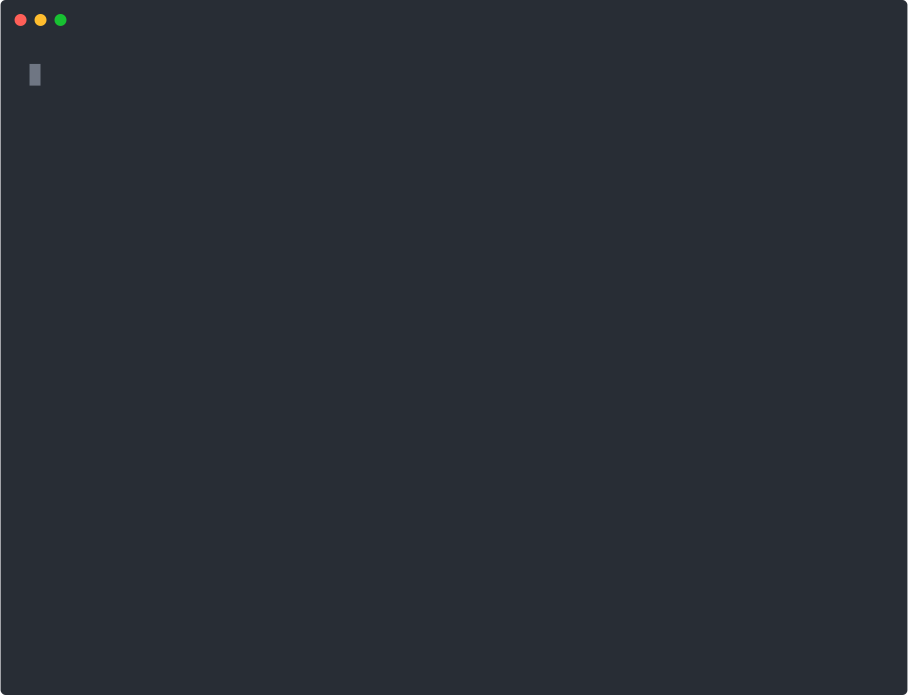

<p align="center">
  
</p>

<h1 align="center">Token Glace</h1>

<p align="center">
  
</p>

<p align="center">
  <strong>Noisy tools burn context. Glace hands the agent the compacted payload.</strong>
</p>

<p align="center">
  Deterministic terminal output compaction: run the command untouched, return a smaller payload from inspectable JSON reducers, keep raw one flag away. Brigade station: brigade add tokens.
</p>

<p align="center">
  <a href="https://brigade.tools/token-glace">Website</a> &middot; <a href="#install">Install</a> &middot; <a href="https://github.com/vincentkoc/tokenjuice">Upstream tokenjuice</a>
</p>

<p align="center">
  
  
  
  
</p>

## Install

```bash
# via Brigade
brigade add tokens

# or see release notes / package for the token-glace binary on your platform
token-glace wrap -- seq 1 6000
token-glace wrap --raw -- seq 1 6000   # full output when you need it
```

The root `station.json` publishes the bounded doctor, UTC statistics, and verification surfaces Brigade checks for this active token station.

> Fork of [vincentkoc/tokenjuice](https://github.com/vincentkoc/tokenjuice) (MIT). This repo publishes the `token-glace` command for the Escoffier fleet.

## What it does

| | Job | What you get |
|---|---|---|
| **Wrap** | Sit between harness and shell | Command still runs; output is observed after |
| **Reduce** | JSON rules, not model vibes | Deterministic compaction for git, test, build, rg noise |
| **Keep raw** | One flag away | `--raw` / `--full` when you need the wall of text |
| **Integrate** | Many clients, one core | Claude Code, Codex, Cursor, OpenClaw, and more |

<p align="center">
  
</p>

<p align="center"><em>Wrap a noisy command, get a head/tail summary, or pass --raw for the full stream.</em></p>


## Integrations

Token Glace installs a thin hook, extension, rule, or guidance file into your client; all of them call the same shared reducer. First-class clients include [Claude Code](https://docs.anthropic.com/en/docs/claude-code), [Codex CLI](https://github.com/openai/codex), [Cursor](https://cursor.com/docs/hooks), [GitHub Copilot CLI](https://github.com/github/copilot-cli), [OpenClaw](https://openclaw.ai/), [OpenCode](https://opencode.ai/), and [pi](https://github.com/badlogic/pi-mono/tree/main/packages/coding-agent), with 100+ more clients in beta.

See **[docs/integrations.md](docs/integrations.md)** for the full client list, each install command, and the hook file it writes.

## Install

The `tokenjuice` name on npm and the `vincentkoc/tap` Homebrew tap install the **upstream** build by Vincent Koc. To install upstream:

```bash
npm install -g tokenjuice
# or
pnpm add -g tokenjuice
# or
yarn global add tokenjuice
# or
brew tap vincentkoc/tap
brew install tokenjuice
```

To run **Token Glace** from this fork's tree, install from source:

```bash
git clone https://github.com/escoffier-labs/token-glace.git
cd token-glace
pnpm install
pnpm build
node dist/cli/main.js --version
# optionally expose it on PATH:
pnpm link --global   # then `token-glace --version`
```

then run it, and install into any client (see [docs/integrations.md](docs/integrations.md) for the full list). Run `token-glace --help` to see the CLI:

```bash
token-glace --help
token-glace --version
token-glace install claude-code   # or any client id from docs/integrations.md
```

OpenClaw support is bundled on the OpenClaw side. Do not run
`token-glace install openclaw`; enable the bundled plugin instead:

```bash
openclaw config set plugins.entries.tokenjuice.enabled true
```

this requires OpenClaw `2026.4.22` or newer.

## Commands

```bash
token-glace --help
token-glace --version
token-glace reduce [file]
token-glace reduce-json [file]
token-glace wrap -- <command> [args...]
token-glace wrap --raw -- <command> [args...]
token-glace wrap --store -- <command> [args...]
token-glace install <client> [--local]   # any client id from docs/integrations.md
token-glace uninstall <client>
token-glace ls
token-glace cat <artifact-id>
token-glace verify
token-glace discover
token-glace doctor
token-glace doctor hooks
token-glace doctor pi
token-glace doctor opencode
token-glace stats
token-glace stats --timezone utc
```

## Overview

Token Glace has three surfaces. `reduce` compacts text that already exists, `wrap` runs a command and compacts the observed output, and `reduce-json` gives host adapters a stable machine protocol. host integrations are intentionally thin: they install a hook, extension, rule, or guidance file; call the shared compactor; and return compacted context through the host's native surface. use `token-glace doctor hooks` to check installed wiring, `token-glace doctor <host>` for one integration, and `token-glace install <host> --local` when validating the current repo build before release.

the reduction engine is rule-driven. built-in JSON rules live in `src/rules`, user overrides live in `~/.config/tokenjuice/rules`, and project overrides live in `.tokenjuice/rules`; later layers override earlier ones by rule id. rules classify command output, normalize lines, keep or drop patterns, count facts, and retain deterministic head/tail slices. host adapters also apply a narrow safe-inventory policy: exact file-content reads stay raw, standalone repository inventory commands can compact, and unsafe mixed command sequences stay raw.

when a reducer gets it wrong or the task needs untouched bytes, use the explicit bypass:

```bash
token-glace wrap --raw -- pnpm --help
token-glace wrap --full -- git status
```

useful maintenance commands:

```bash
token-glace verify --fixtures
token-glace discover
token-glace doctor hooks
token-glace stats --timezone utc
```

## Why not something else?

- **Raising the harness output limit** just moves the cost. A bigger context window still fills with `pnpm test` noise and `docker build` layer spam, and you pay for every token on every turn. Token Glace shrinks the payload at the boundary instead of paying to carry it.
- **An LLM-based summarizer** is non-deterministic, costs another model call, and can hallucinate away the one error line you needed. Token Glace reduces with inspectable JSON rules, so the same input always produces the same output and nothing is invented.
- **Truncating with `head` / `tail`** is blunt: it keeps the wrong lines, drops the failing assertion in the middle, and has no idea which command it is looking at. Token Glace classifies the command first, then keeps the lines that matter for that command.
- **Hand-rolled per-tool wrappers** scatter brittle parsing across every integration. Token Glace keeps one shared reducer and thin host adapters, so a fix lands once and every host benefits.

## What Token Glace is not

Token Glace is an output compactor, not a shell, a sandbox, or a security tool.

It does not:

- rewrite, reorder, or reinterpret the command you run (the original command executes untouched)
- sandbox commands or restrict what they are allowed to do
- redact secrets or scrub sensitive content from output
- discard raw bytes (raw stays one explicit `--raw` / `--full` flag, or opt-in artifact storage, away)
- summarize with a model, guess, or invent lines that were not in the real output

## What this fork changes

This repository is a fork of [vincentkoc/tokenjuice](https://github.com/vincentkoc/tokenjuice). The upstream project owns the reducer engine, the host integration matrix, and the CLI surface. This fork:

- re-points its own project metadata (`package.json` `homepage`, `repository`, and `bugs`) at `escoffier-labs/token-glace` so issues and source links for this tree resolve here
- publishes `token-glace` as the primary command while retaining `tokenjuice` as a legacy alias for existing hooks and workflows
- tracks the build the Escoffier Labs agent fleet runs, with fork-specific maintenance and integration work
- tunes the agent-facing output for safety and signal: a neutral, non-instructional compaction footer (no "treat as authoritative / do not re-run / proceed" directives), the same neutral wording in the host-instruction guidance, and a Claude Code size gate (`wrap --min-reduce-chars`, default 16384) so only genuinely large output is compacted
- retains Vincent Koc's copyright and the full MIT permission notice in [LICENSE](LICENSE), with a second copyright line added alongside, and keeps the upstream credit throughout this README

The `tokenjuice` npm package and the `vincentkoc/tap` formula install upstream's build; run this fork [from source](#install) as `token-glace`. Contributions are welcome here, and improvements that are not fork-specific may also be offered upstream to [vincentkoc/tokenjuice](https://github.com/vincentkoc/tokenjuice). See [CONTRIBUTING.md](CONTRIBUTING.md).

## Adapter JSON

`reduce-json` is the machine-facing adapter command. it reads JSON from stdin or a file and always writes JSON to stdout; see the [spec](docs/spec.md) for envelope options and adapter behavior.

direct payload:

```json
{
  "toolName": "exec",
  "command": "pnpm test",
  "argv": ["pnpm", "test"],
  "combinedText": "RUN  v3.2.4 /repo\n...",
  "exitCode": 1
}
```

## Docs

- [Client integrations](docs/integrations.md) - every supported and beta client, install commands, and per-client docs
- [spec](docs/spec.md), [rules](docs/rules.md), [integration playbook](docs/integration-playbook.md)
- [security](SECURITY.md)

## Status

usable foundation for token reduction with diagnostics and a growing reducer set, now focused on deeper coverage and tuning.

💙 built by [Vincent Koc](https://github.com/vincentkoc).
