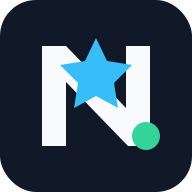
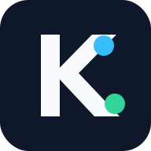

# tokenjuice client integrations

tokenjuice installs a thin hook, extension, rule, or guidance file into each client, and every one calls the same shared reducer. This page lists each supported and beta client with its install command, hook file, and per-client docs. For what tokenjuice does and how this fork differs from [vincentkoc/tokenjuice](https://github.com/vincentkoc/tokenjuice), see the [README](../README.md).

## Clients

supported integrations:

| Logo | Client | Install | Hook file |
| --- | --- | --- | --- |
|  | [Claude Code](https://docs.anthropic.com/en/docs/claude-code) | `tokenjuice install claude-code` | `~/.claude/settings.json` |
|  | [CodeBuddy](https://codebuddy.tencent.com/) | `tokenjuice install codebuddy` | `~/.codebuddy/settings.json` |
|  | [Codex CLI](https://github.com/openai/codex) | `tokenjuice install codex` | `~/.codex/hooks.json` |
|  | [Cursor](https://cursor.com/docs/hooks) | `tokenjuice install cursor` | `~/.cursor/hooks.json` |
|  | [Droid (Factory CLI)](https://docs.factory.ai/cli/configuration/hooks-guide) | `tokenjuice install droid` | `~/.factory/settings.json` |
|  | [GitHub Copilot CLI](https://github.com/github/copilot-cli) | `tokenjuice install copilot-cli` | `~/.copilot/hooks/tokenjuice-cli.json` |
|  | [OpenClaw](https://openclaw.ai/) | `openclaw config set plugins.entries.tokenjuice.enabled true` | `~/.openclaw/openclaw.json` |
|  | [OpenCode](https://opencode.ai/) | `tokenjuice install opencode` | `~/.config/opencode/plugins/tokenjuice.js` |
|  | [pi](https://github.com/badlogic/pi-mono/tree/main/packages/coding-agent) | `tokenjuice install pi` | `~/.pi/agent/extensions/tokenjuice.js` |
|  | [VS Code Copilot Chat](https://code.visualstudio.com/docs/copilot/overview) | `tokenjuice install vscode-copilot` | `~/.copilot/hooks/tokenjuice-vscode.json` |

beta integrations:

| Logo | Client | Install | Hook file |
| --- | --- | --- | --- |
|  | [AdaL CLI](https://docs.sylph.ai/features/plugins-and-skills) | `tokenjuice install adal` | `AGENTS.md` |
|  | [Aether](https://aether-agent.io/) | `tokenjuice install aether` | `.aether/tokenjuice.md` / `.aether/settings.json` |
|  | [aictl](https://www.aictl.app/) | `tokenjuice install aictl` | `AICTL.md` |
|  | [AI Memory Protocol](https://github.com/bburda/ai_memory_protocol) | `tokenjuice install ai-memory-protocol` | `.memories/memory/preferences.rst` |
|  | [Aider](https://aider.chat/) | `tokenjuice install aider` | `CONVENTIONS.tokenjuice.md` |
|  | [Agent Layer](https://agent-layer.dev/docs/) | `tokenjuice install agent-layer` | `.agent-layer/instructions/tokenjuice.md`; run `al sync` after install or uninstall |
|  | [AgentInit](https://pypi.org/project/agentinit/) | `tokenjuice install agentinit` | `AGENTS.md`; run `agentinit sync` after install or uninstall |
|  | [Agentlink](https://agentlink.run/) | `tokenjuice install agentlink` | `AGENTS.md`; run `agentlink sync` after install or uninstall |
|  | [Agentloom](https://agentloom.sh/docs) | `tokenjuice install agentloom` | `.agents/rules/tokenjuice-agentloom.md`; run `agentloom sync` after install or uninstall |
|  | [agents-cli](https://agents-cli.sh/) | `tokenjuice install agents-cli` | `~/.agents/memory/AGENTS.md`; run `agents sync` after install or uninstall |
|  | [AGENTS.md](https://agents.md/) | `tokenjuice install agents-md` | `AGENTS.md` |
|  | [agents.ge](https://agents.ge/) | `tokenjuice install agentsge` | `.agents/rules/tokenjuice-agentsge.md` |
|  | [AgentsMesh](https://samplexbro.github.io/agentsmesh/) | `tokenjuice install agentsmesh` | `.agentsmesh/rules/tokenjuice.md`; run `agentsmesh generate` after install or uninstall |
|  | [Amazon Q Developer CLI / Kiro compatibility](https://kiro.dev/docs/cli/migrating-from-q/) | `tokenjuice install amazon-q` | `.amazonq/rules/tokenjuice.md` |
|  | [Amp](https://ampcode.com/manual) | `tokenjuice install amp` | `AGENTS.md` / `AGENT.md` / `CLAUDE.md` |
|  | [Google Antigravity](https://antigravity.google/) | `tokenjuice install antigravity` | `.agents/rules/tokenjuice.md` |
|  | [anywhere-agents](https://anywhere-agents.readthedocs.io/) | `tokenjuice install anywhere-agents` | `AGENTS.local.md`; run `anywhere-agents` after install or uninstall |
|  | [Augment](https://docs.augmentcode.com/cli/rules) | `tokenjuice install augment` | `.augment/rules/tokenjuice.md` |
|  | [Avante.nvim](https://github.com/yetone/avante.nvim) | `tokenjuice install avante` | `avante.md` |
|  | [Baz](https://docs.baz.co/agents/skills-and-instructions) | `tokenjuice install baz` | `.baz/skills/tokenjuice/SKILL.md` |
|  | [Bito](https://docs.bito.ai/ai-code-reviews-in-git/agent-settings/repo-level-settings) | `tokenjuice install bito` | `.bito.yaml` / `.bito/tokenjuice.md` |
|  | [Blackbox CLI](https://docs.blackbox.ai/features/blackbox-cli/skills) | `tokenjuice install blackbox` | `.blackbox/skills/tokenjuice/SKILL.md` |
|  | [Blocks](https://docs.blocks.team/using-blocks/features/skills) | `tokenjuice install blocks` | `.agents/skills/tokenjuice-blocks/SKILL.md` |
|  | [Clawdbot](https://docs.clawd.bot/skills) | `tokenjuice install clawdbot` | `skills/tokenjuice/SKILL.md` |
|  | [IBM Bob Shell](https://bob.ibm.com/docs/shell/configuration/configuring) | `tokenjuice install bob` | `AGENTS.md` |
|  | [Builder](https://www.builder.io/c/docs/projects-configuration-files) | `tokenjuice install builder` | `.builder/rules/tokenjuice.mdc` |
|  | [Charlie](https://docs.charlielabs.ai/customization/instructions) | `tokenjuice install charlie` | `AGENTS.md` |
|  | [Cline](https://docs.cline.bot/features/hooks/hook-reference) | `tokenjuice install cline` | `~/Documents/Cline/Hooks/tokenjuice-post-tool-use` |
|  | [CodeAnt](https://docs.codeant.ai/ide/review/code_review_instructions) | `tokenjuice install codeant` | `.codeant/instructions.json` |
|  | [Codebuff](https://www.codebuff.com/docs/help/quick-start) | `tokenjuice install codebuff` | `AGENTS.md` |
|  | [Codegen](https://docs.codegen.com/settings/repo-rules) | `tokenjuice install codegen` | `AGENTS.md` |
|  | [Coder Agents](https://coder.com/docs/ai-coder/agents) | `tokenjuice install coder-agents` | `.agents/skills/tokenjuice/SKILL.md` |
|  | [CodeRabbit](https://docs.coderabbit.ai/configuration/path-instructions) | `tokenjuice install coderabbit` | `.coderabbit.yaml` |
|  | [Command Code](https://commandcode.ai/docs/) | `tokenjuice install command-code` | `~/.commandcode/settings.json` / `.commandcode/settings.json` |
|  | [Continue](https://docs.continue.dev/) | `tokenjuice install continue` | `.continue/rules/tokenjuice.md` |
|  | [Crush](https://github.com/charmbracelet/crush) | `tokenjuice install crush` | `.crush/skills/tokenjuice/SKILL.md` |
|  | [Deep Agents Code](https://docs.langchain.com/oss/javascript/deepagents/code/overview) | `tokenjuice install deepagents` | `.deepagents/AGENTS.md` |
|  | [Devin for Terminal](https://cli.devin.ai/docs/extensibility/hooks/overview) | `tokenjuice install devin` | `.devin/hooks.v1.json` |
|  | [dot-agents](https://www.dot-agents.com/) | `tokenjuice install dot-agents` | `~/.agents/rules/global/rules.mdc`; run `dot-agents sync` after install or uninstall |
|  | [Docker Agent](https://docs.docker.com/ai/docker-agent/) | `tokenjuice install docker-agent` | `.docker-agent/tokenjuice.md` |
|  | [ECA](https://eca.dev/) | `tokenjuice install eca` | `.eca/skills/tokenjuice/SKILL.md` |
|  | [Elyra](https://elyracode.com/) | `tokenjuice install elyra` | `.elyra/skills/tokenjuice/SKILL.md` |
|  | [Firebase Studio](https://firebase.google.com/docs/studio/set-up-gemini) | `tokenjuice install firebase-studio` | `.idx/airules.md` |
|  | [ForgeCode](https://forgecode.dev/docs/custom-rules/) | `tokenjuice install forgecode` | `AGENTS.md` |
|  | [Gemini CLI](https://github.com/google-gemini/gemini-cli) | `tokenjuice install gemini-cli` | `~/.gemini/settings.json` |
|  | [GitLab Duo Agent Platform](https://docs.gitlab.com/user/duo_agent_platform/customize/custom_rules/) | `tokenjuice install gitlab-duo` | `.gitlab/duo/chat-rules.md` |
|  | [Goose](https://goose-docs.ai/) | `tokenjuice install goose` | `.goosehints` |
|  | [Greptile](https://www.greptile.com/docs/code-review/greptile-config) | `tokenjuice install greptile` | `.greptile/rules.md` |
|  | [Grok Build](https://docs.x.ai/build/overview) | `tokenjuice install grok-build` | `AGENTS.md` |
|  | [Grok CLI](https://github.com/superagent-ai/grok-cli) | `tokenjuice install grok-cli` | `~/.grok/user-settings.json` |
|  | [gptme](https://gptme.org/docs/prompts.html) | `tokenjuice install gptme` | `AGENTS.md` |
|  | [GitHub Copilot coding agent](https://docs.github.com/en/copilot/using-github-copilot/coding-agent) | `tokenjuice install copilot-agent` | `.github/hooks/tokenjuice-agent.json` |
|  | [Jean2](https://jean2.ai/docs/deep-dive/agents-md) | `tokenjuice install jean2` | `AGENTS.md` |
|  | [JetBrains AI Assistant](https://www.jetbrains.com/help/ai-assistant/) | `tokenjuice install jetbrains-ai` | `.aiassistant/rules/tokenjuice.md` |
|  | [Junie](https://junie.jetbrains.com/docs/junie-cli-usage.html) | `tokenjuice install junie` | `.junie/AGENTS.md` |
|  | [Jules](https://jules.google/docs/) | `tokenjuice install jules` | `AGENTS.md` |
|  | [LeanCTL](https://leanctl.com/docs/configuration) | `tokenjuice install leanctl` | `.leanctl/instructions.md` |
|  | [Kimi Code CLI](https://moonshotai.github.io/kimi-cli/en/) | `tokenjuice install kimi` | `~/.kimi/config.toml` |
|  | [Kiro](https://kiro.dev/) | `tokenjuice install kiro` | `.kiro/steering/tokenjuice.md` |
|  | [Kilo Code](https://kilocode.ai/) | `tokenjuice install kilo` | `kilo.jsonc` or `.kilo/kilo.jsonc` + `.kilo/rules/tokenjuice.md` |
|  | [LocalCode](https://www.localcode.codes/) | `tokenjuice install localcode` | `~/.localcode/plugins/tokenjuice/` |
|  | [mcp-agent](https://docs.mcp-agent.com/) | `tokenjuice install mcp-agent` | `.mcp-agent/agents/tokenjuice.md` |
|  | [mini-SWE-agent](https://mini-swe-agent.com/) | `tokenjuice install mini-swe-agent` | `.mini-swe-agent/tokenjuice.yaml` |
|  | [SWE-agent](https://swe-agent.com/latest/) | `tokenjuice install swe-agent` | `.swe-agent/tokenjuice.yaml` |
|  | [Stagewise](https://docs.stagewise.io/agent/skills-and-context) | `tokenjuice install stagewise` | `.stagewise/skills/tokenjuice/SKILL.md` |
|  | [Mistral Vibe](https://docs.mistral.ai/mistral-vibe/agents-skills) | `tokenjuice install mistral-vibe` | `AGENTS.md` |
|  | [Mux](https://mux.coder.com/hooks/tools) | `tokenjuice install mux` | `.mux/tool_post` |
|  | [NovaKit CLI](https://www.novakit.ai/docs/cli) | `tokenjuice install novakit` | `NOVAKIT.md` |
|  | [Knowns](https://knowns.sh/) | `tokenjuice install knowns` | `KNOWNS.md` |
|  | [Ona Agent](https://ona.com/docs/ona/agents/overview) | `tokenjuice install ona` | `.ona/skills/tokenjuice/SKILL.md` |
|  | [OpenHands](https://docs.openhands.dev/) | `tokenjuice install openhands` | `.openhands/hooks.json` |
|  | [Open Interpreter](https://www.openinterpreter.com/docs/terminal/agents_md) | `tokenjuice install open-interpreter` | `AGENTS.md` |
|  | [Open WebUI](https://openwebui.com/) | `tokenjuice install openwebui` | `.openwebui/tools/tokenjuice_compact.py` |
|  | [pi-go](https://pi-go.sh/) | `tokenjuice install pi-go` | `.pi/skills/tokenjuice/SKILL.md` |
|  | [Plandex](https://docs.plandex.ai/) | `tokenjuice install plandex` | `PLANDEX.tokenjuice.md` |
|  | [Qodo Code Review](https://docs.qodo.ai/code-review/get-started/configuration-overview/configuration-file) | `tokenjuice install qodo` | `.pr_agent.toml` |
|  | [Qoder CLI](https://docs.qoder.com/cli/using-cli) | `tokenjuice install qoder` | `AGENTS.md` |
|  | [Qwen Code](https://qwenlm.github.io/qwen-code-docs/) | `tokenjuice install qwen-code` | `.qwen/settings.json` |
|  | [Replit Agent](https://docs.replit.com/references/project-setup/replit-dot-md) | `tokenjuice install replit` | `replit.md` |
|  | [Roo Code](https://roocode.com/) | `tokenjuice install roo` | `.roo/rules/tokenjuice.md` |
|  | [Rovo Dev CLI](https://support.atlassian.com/rovo/docs/use-memory-in-rovo-dev-cli/) | `tokenjuice install rovo` | `AGENTS.md` |
|  | [Ruler](https://github.com/intellectronica/ruler) | `tokenjuice install ruler` | `.ruler/tokenjuice.md` |
|  | [Tabby](https://tabby.tabbyml.com/) | `tokenjuice install tabby` | `~/.tabby/config.toml` |
|  | [Tabnine CLI](https://docs.tabnine.com/main/getting-started/tabnine-cli/features/cli-commands) | `tokenjuice install tabnine` | `TABNINE.md` |
|  | [Trae](https://traeide.com/) | `tokenjuice install trae` | `.trae/rules/project_rules.md` |
|  | [UiPath for Coding Agents](https://www.uipath.com/developers/coding-agents) | `tokenjuice install uipath` | `AGENTS.md` |
|  | [Warp](https://docs.warp.dev/agent-platform/capabilities/rules) | `tokenjuice install warp` | `AGENTS.md` / `WARP.md` |
|  | [Windsurf](https://windsurf.com/) | `tokenjuice install windsurf` | `.windsurf/rules/tokenjuice.md` |
|  | [Zed](https://zed.dev/docs/ai/rules.html) | `tokenjuice install zed` | `.rules` |
|  | [Zencoder](https://docs.zencoder.ai/rules-context/zen-rules) | `tokenjuice install zencoder` | `.zencoder/rules/tokenjuice.md` |

## Install and uninstall

Run from this fork's source build (see [Install](../README.md#install) in the README), then install or uninstall any client by id:

```bash
tokenjuice install <client>
tokenjuice install <client> --local   # validate the current repo build before release
tokenjuice uninstall <client>
```

`<client>` is any id from the tables above (for example `claude-code`, `codex`, `cursor`, `copilot-cli`). OpenClaw is bundled on the OpenClaw side: do not run `tokenjuice install openclaw`; instead enable the plugin with `openclaw config set plugins.entries.tokenjuice.enabled true` (requires OpenClaw `2026.4.22` or newer).

## Integration docs


- [spec](spec.md)
- [rules](rules.md)
- [integration playbook](integration-playbook.md)
- [AdaL CLI integration](adal-integration.md)
- [Aether integration](aether-integration.md)
- [Agent Layer integration](agent-layer-integration.md)
- [AgentInit integration](agentinit-integration.md)
- [Agentlink integration](agentlink-integration.md)
- [Agentloom integration](agentloom-integration.md)
- [agents-cli integration](agents-cli-integration.md)
- [AGENTS.md integration](agents-md-integration.md)
- [agents.ge integration](agentsge-integration.md)
- [AgentsMesh integration](agentsmesh-integration.md)
- [Amp integration](amp-integration.md)
- [Amazon Q integration](amazon-q-integration.md)
- [aictl integration](aictl-integration.md)
- [AI Memory Protocol integration](ai-memory-protocol-integration.md)
- [Antigravity integration](antigravity-integration.md)
- [anywhere-agents integration](anywhere-agents-integration.md)
- [Augment integration](augment-integration.md)
- [Baz integration](baz-integration.md)
- [Bito integration](bito-integration.md)
- [Blackbox integration](blackbox-integration.md)
- [Blocks integration](blocks-integration.md)
- [Clawdbot integration](clawdbot-integration.md)
- [IBM Bob integration](bob-integration.md)
- [Builder integration](builder-integration.md)
- [Charlie integration](charlie-integration.md)
- [GitHub Copilot coding agent integration](copilot-agent-integration.md)
- [CodeAnt integration](codeant-integration.md)
- [Codebuff integration](codebuff-integration.md)
- [Codegen integration](codegen-integration.md)
- [Coder Agents integration](coder-agents-integration.md)
- [CodeRabbit integration](coderabbit-integration.md)
- [Command Code integration](command-code-integration.md)
- [Crush integration](crush-integration.md)
- [Cursor integration](cursor-integration.md)
- [CodeBuddy integration](codebuddy-integration.md)
- [Deep Agents Code integration](deepagents-integration.md)
- [Devin integration](devin-integration.md)
- [dot-agents integration](dot-agents-integration.md)
- [Docker Agent integration](docker-agent-integration.md)
- [ECA integration](eca-integration.md)
- [Elyra integration](elyra-integration.md)
- [ForgeCode integration](forgecode-integration.md)
- [Goose integration](goose-integration.md)
- [Greptile integration](greptile-integration.md)
- [Grok Build integration](grok-build-integration.md)
- [Grok CLI integration](grok-cli-integration.md)
- [gptme integration](gptme-integration.md)
- [Jean2 integration](jean2-integration.md)
- [JetBrains AI Assistant integration](jetbrains-ai-integration.md)
- [LeanCTL integration](leanctl-integration.md)
- [Kimi integration](kimi-integration.md)
- [Kiro integration](kiro-integration.md)
- [Kilo Code integration](kilo-integration.md)
- [LocalCode integration](localcode-integration.md)
- [mcp-agent integration](mcp-agent-integration.md)
- [mini-SWE-agent integration](mini-swe-agent-integration.md)
- [SWE-agent integration](swe-agent-integration.md)
- [Stagewise integration](stagewise-integration.md)
- [Mistral Vibe integration](mistral-vibe-integration.md)
- [Mux integration](mux-integration.md)
- [NovaKit integration](novakit-integration.md)
- [Knowns integration](knowns-integration.md)
- [Ona integration](ona-integration.md)
- [Open Interpreter integration](open-interpreter-integration.md)
- [Open WebUI integration](openwebui-integration.md)
- [pi-go integration](pi-go-integration.md)
- [Plandex integration](plandex-integration.md)
- [Qodo integration](qodo-integration.md)
- [Qoder integration](qoder-integration.md)
- [Qwen Code integration](qwen-code-integration.md)
- [Replit integration](replit-integration.md)
- [Roo Code integration](roo-integration.md)
- [Rovo integration](rovo-integration.md)
- [Ruler integration](ruler-integration.md)
- [Tabby integration](tabby-integration.md)
- [Tabnine integration](tabnine-integration.md)
- [Trae integration](trae-integration.md)
- [UiPath integration](uipath-integration.md)
- [Warp integration](warp-integration.md)
- [Windsurf integration](windsurf-integration.md)
- [Zencoder integration](zencoder-integration.md)
- [security](../SECURITY.md)
